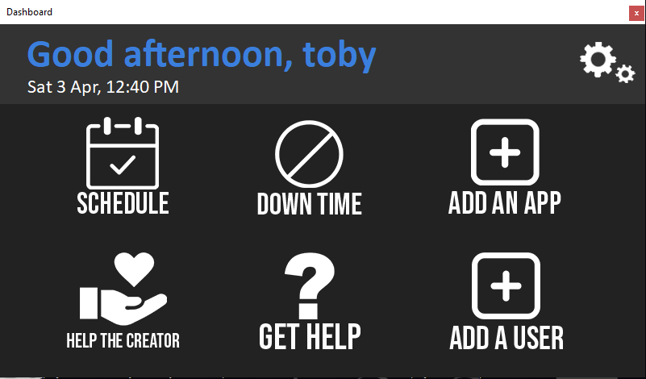
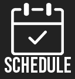
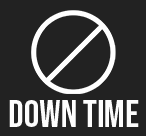
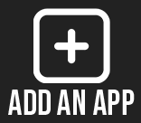

# Gamelock-project

## THIS PROJECT IS NO LONGER BEING WORKED ON / DEVELOPED, IT IS SIMPLY AN ARCHIVED VERSION OF AN OLD PROJECT WHICH IS PRETTY BAD

This is a HUGE project. This will lock games when people want to revise for work, school or want to distance themselves from games. You will be able to set times for revision or work so the app blocks games or any programs that can distract you. Coded in windows forms in c#

I am the sole developer of this app and it will take me around a year to completely finish. I will also be using this for myself.

## The UI
The ui is smart and simple. Designed to be easily understandable and easy to use with everything you need to get started on the front page. Below you will find what each button does

The app greets you based on the time of day, and also addresses you by the name you set within the app upon first startup. The colours are also subject to change but currently i am happy with the ui's design

In the future i am planning to have a "kids ui" where it is a lot more colourful. I am also planning on adding a currency system to reward you for your revision time, you will be able to spend these coins within an in-app shop

## The buttons

Schedule - The schedule window is not finished yet. But it will be able to show all of the scheduled "down times" over a one or two week period. The dimensions are planned to either be 1920x1080 or to fill the users whole screen to easily access and view the down times

Down time - the down time button will be where you select and edit your down time for each day of the week, or set it for the whole week, or just a weekend. Currently it is fully functional and the down times can be set and removed

Add app - Here's where you add an app to be blocked when you are in "down time" - you only need to use this function for specific programs that aren't blocked by the app's default library

Help the creator - Here is where i will set up a donation page if anyone is kind enough to donate to my app! It would be greatly appreciated

Get help - Here's where you can find what everything does, and how to get started easily with downtime

Add a user - Here's where you can set different profiles for the app, where you can have seperate downtimes for each user, or person who uses the computer (this is optional)

Settings - Here i am planning to add accessibility functions such as larger text, brighter colours and a colour scheme changer.
